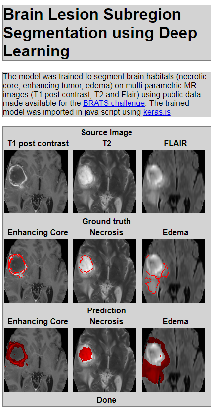
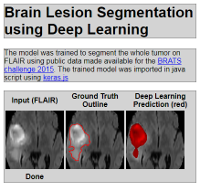

This repository contains code that will allow to train a deep learning keras model for tumor segmention on brain MR, and shows how to use the model to run the deep learning inference in the browser.

The examples can be run from [https://mirabelarusu.github.io/deep_learning_inference_browser/](https://mirabelarusu.github.io/deep_learning_inference_browser/)

[](https://github.build.ge.com/pages/212459265/deep_learning_inference_browser/src/brain-lesion-segmentation.html)
[](https://github.build.ge.com/pages/212459265/deep_learning_inference_browser/src/brain-lesion-segmentation-simple.html)
## Code Requirements

In order to run the code in this repository you will need: 

1. [Keras](https://keras.io/) and all its dependences including nvidia and cuda. [See installation instructions](https://keras.io/#installation)

2. [encoder.py](https://github.com/transcranial/keras-js/blob/master/encoder.py) from [keras.js](https://github.com/transcranial/keras-js) which converts the model that is output by keras (model.hdf5) into the model needed by keras.js which is used to run the inference

3. Install [node.js](https://nodejs.org/en/)  

4. Use [package.json](package.json) to install dependences (keras.js and browserify)

```sh
npm install
```

## Data 

1. Get the [Brats data](https://sites.google.com/site/braintumorsegmentation/home/brats_2016) 2016 - segmentation of tumor subregions. Download the data (e.g. the content of the HGG folder in the local folder step1_train_model/Data )

2. Your test images: we provide here a few examples 

## Summary of steps 

There are two main steps:

### Step 1: Train the model

* The [settings.py](step1_train_model/settings.py) is used to store paths, filenames, input varibles. The Data folder is by default `step1_train_model/Data` and the Results folder is
`step1_train_model/Results`. The code was tested with the 200 subjects in the HGG cohort provided by the BRATS challenge [Brats data](https://sites.google.com/site/braintumorsegmentation/home/brats_2016)

* Train model by running the preprocessing [preprocess.py](step1_train_model/preprocess.py) and training [train.py](step1_train_model/train.py). The local 


```sh
cd Step1_train_model
python preprocess.py
python train.py
```

The output of this step is a model stored in `Results/brainWholeTumor_009.hdf5`. 

The model is encoded using [encoder.py](https://github.com/transcranial/keras-js/blob/master/encoder.py)

```sh
python encoder.py Results/brainWholeTumor_009.hdf5
```

The script creates `Results/brainActiveTumor_009_metadata.json` and `Results/brainActiveTumor_009_weights.buf` which are required by keras.js.

### Step 2: Create Java script file to load the model and run the inference

* Create js file that will load and run the model. Instructions 4-5 from [here](https://github.com/transcranial/keras-js#usage) provide a summary of content. Our example file is `step2_run_inference_in_browser/src/brain-lesion-segmentation-simple.js`


* Use browserify to create bundle js that will be imported in the browser: 
```sh
browserify step2_run_inference_in_browser/src/brain-lesion-segmentation-simple.js > docs/dist/brain-lesion-segmentation-simple.js
```

* Import js code in html: [brain-lesion-segmentation-simple.html](docs/src/brain-lesion-segmentation-simple.html) starting line 40

```html
<!-- Load dependences -->
<script src="../ext/keras.js"></script>

<!-- Run inference -->  
<script src="../dist/brain-lesion-segmentation-simple.js"></script>
```


